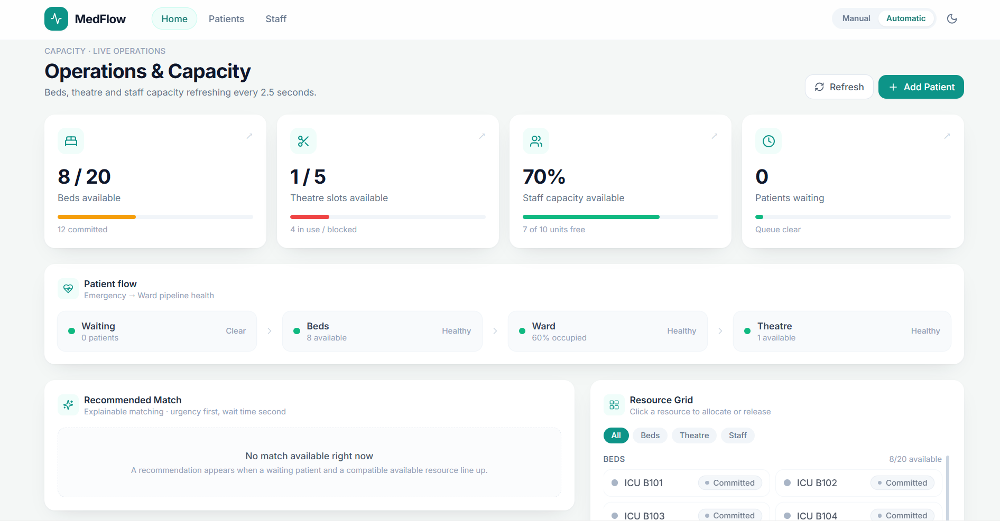
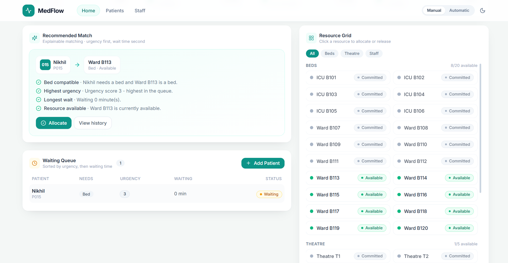
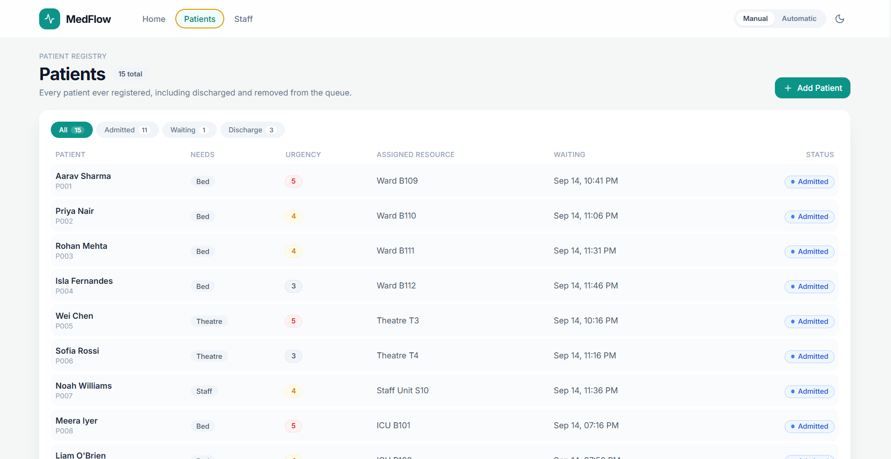
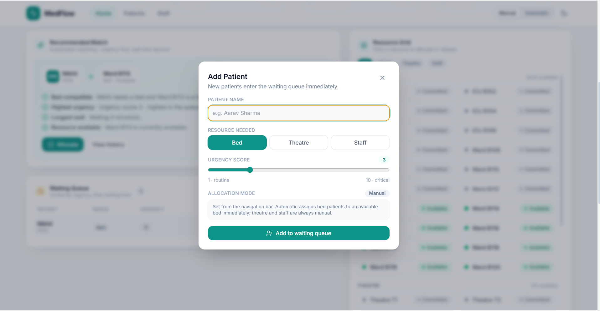
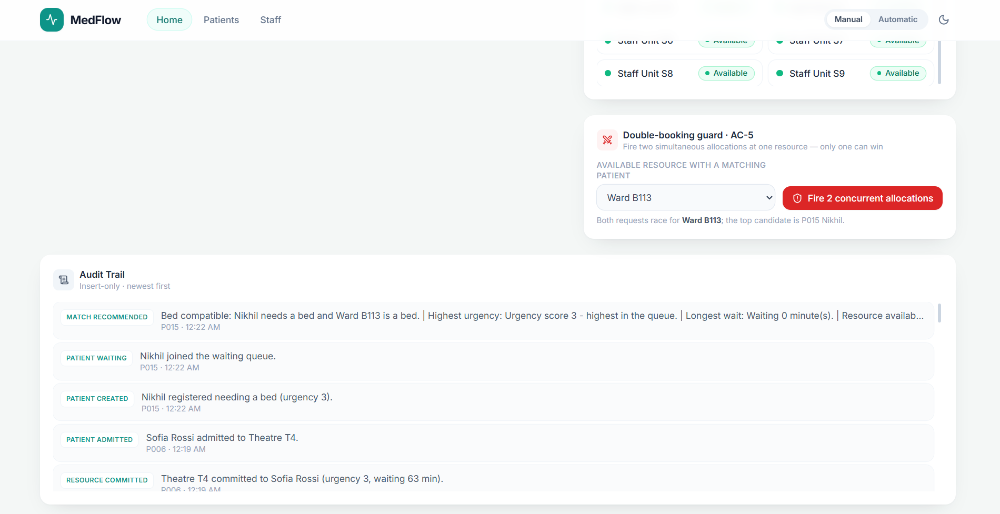

# MedFlow — Hospital Capacity & Patient Flow Control Center

A Windows-desktop control center that gives hospital operations staff near-real-time
visibility into beds, theatre slots and staff capacity, automatically matches waiting
patients to compatible resources, prevents double-booking at the database level, and
keeps an append-only audit trail of every state change.

Built as a hackathon MVP with **Electron + React + Vite (TypeScript) + FastAPI + SQLite**.

---

## What is MedFlow?

MedFlow is a hospital operations control center designed to help staff answer five questions in real time:

**What capacity do we have?**  
**Who is waiting?**  
**What should happen next?**  
**Can we allocate the resource safely?**  
**Can we prove what happened afterward?**

It connects capacity visibility, patient flow, explainable resource matching, safe allocation, and complete traceability in one operational workflow.

### The MedFlow Flow

**SEE → UNDERSTAND → RECOMMEND → ALLOCATE SAFELY → TRACE**

---
## The four outcomes this MVP demonstrates

1. **Visibility** — live dashboard of bed / theatre / staff capacity and the waiting queue.
2. **Matching** — deterministic, explainable recommendation of the best waiting patient
   for a compatible resource (urgency first, wait time second).
3. **Safe allocation** — a single atomic conditional `UPDATE` guarantees a resource can
   never be committed to two patients, even under concurrent requests.
4. **Traceability** — every patient and resource state change is written to an
   insert-only `events` table. There is no update or delete path.

---

## 📸 MedFlow in Action

### Operations & Capacity Overview



### Live Hospital Operations Dashboard



### Patient Registry



### Add Patient Workflow



### Audit Trail


## Architecture

```
 Windows Desktop (Electron)
 ┌─────────────────────────────────────────────┐
 │  React + Vite + TypeScript dashboard        │
 │  (TanStack Query polling every 2.5 s)       │
 └───────────────────┬─────────────────────────┘
                     │ localhost REST (http://127.0.0.1:8000)
                     ▼
              FastAPI backend
   ┌──────────────┬──────────────┬──────────────┐
   │ repositories │  services    │   domain     │
   │  (SQL/ORM)   │ (workflow +  │ (matching +  │
   │              │ transactions)│ state machine)│
   └──────────────┴──────────────┴──────────────┘
                     ▼
              SQLite (hospital.db, WAL)
```

Layered on purpose: `api` (routers) → `services` (orchestration + transactions) →
`repositories` (all SQL) → `domain` (pure business rules). The three tables are the
single source of truth; there is no separate `allocations` table — current commitment
state lives on `resources.status`, history lives in `events`.

---

## Tech stack

| Layer            | Technology                                             |
| ---------------- | ------------------------------------------------------ |
| Desktop shell    | Electron 33                                            |
| Frontend         | React 18 + TypeScript + Vite 6                         |
| Styling          | Tailwind CSS (teal clinical theme, Lucide icons)       |
| Data sync        | TanStack Query polling (2.5 s) — no WebSockets         |
| Backend          | FastAPI (Python 3.11+; verified on 3.14)               |
| ORM / data       | SQLAlchemy 2.0 + one raw conditional `UPDATE`          |
| Database         | SQLite (`backend/hospital.db`), WAL mode               |
| Tests            | pytest + FastAPI TestClient                            |

---

## Repository layout

```
backend/
  main.py                     FastAPI app, CORS, error handlers, /docs
  database.py                 engine, sessions, Base, SQLite PRAGMAs
  models/db_models.py         Resource / Patient / Event ORM mappings
  schemas/pydantic_schemas.py request + response models
  repositories/               all SQL access (atomic commit lives here)
  services/                   allocation / patient / resource / matching
  domain/                     matching rules + state machine (pure)
  api/routers/                health, resources, patients, matches, events
seed.py                       wipe + recreate a consistent demo state
tests/                        pytest suite (incl. the concurrency race test)
src/                          React + TypeScript dashboard
  components/                 tiles, bottleneck strip, queue, grid, modals, race sim
  hooks/useHospitalData.ts    TanStack Query hooks (polling + mutations)
  services/api.ts             typed fetch client
electron/main.cjs             Electron main process
```

---

## Prerequisites

- **Windows**
- **Python 3.11+** (3.14 tested)
- **Node.js 18+** and npm

---

## Setup (fresh clone)

```powershell
# 1. Backend virtual environment + dependencies
python -m venv .venv
.\.venv\Scripts\python.exe -m pip install --upgrade pip
.\.venv\Scripts\python.exe -m pip install -r requirements.txt

# 2. Create the demo database
.\.venv\Scripts\python.exe seed.py

# 3. Frontend dependencies
npm install
```

> If `npm install` reports that install scripts were skipped (newer npm has an
> `allow-scripts` gate) and `electron` / `esbuild` binaries are missing, run
> `npm approve-scripts --all` and then `npm rebuild`.

---

## Running the app

### One command (backend + Vite + Electron)

```powershell
npm run dev
```

This starts FastAPI on `127.0.0.1:8000`, Vite on `127.0.0.1:5173`, waits for the dev
server, then launches the Electron window.

### Or run the layers separately (useful while developing)

```powershell
# Terminal 1 — backend
.\.venv\Scripts\python.exe -m uvicorn backend.main:app --host 127.0.0.1 --port 8000

# Terminal 2 — web UI (browser at http://127.0.0.1:5173)
npm run dev:web

# Terminal 3 — desktop shell
npm run dev:electron
```

### Production-style Electron build

```powershell
npm run build          # type-check + build React into dist/
npm run start:prod     # Electron loads dist/index.html
```

---

## Resetting the demo

```powershell
.\.venv\Scripts\python.exe seed.py     # or: npm run seed
```

`seed.py` drops and recreates all tables, then inserts a known state:

- 20 beds (12 available / 8 committed)
- 5 theatre slots (3 available / 2 committed)
- 10 staff capacity units (8 available / 2 committed)
- 14 patients (7 waiting / 4 admitted / 3 discharged)
- a populated audit trail

It is idempotent — safe to run after any experiment or crash.

---

## Database overview

Exactly **three tables**:

| Table       | Columns                                                                                   |
| ----------- | ----------------------------------------------------------------------------------------- |
| `resources` | `id, type (bed\|theatre\|staff), name, status (available\|committed), version, updated_at` |
| `patients`  | `id, name, status (waiting\|admitted\|discharged), resource_type_needed, urgency_score, waiting_since, current_resource_id` |
| `events`    | `id, patient_id, resource_id, event_type, note, created_at`                                |

`events` is **insert-only** from the application (no PUT/DELETE/PATCH route exists for it).
`current_resource_id` is a nullable convenience pointer that answers "which resource do I
free on discharge?" without scanning event history — the full history still lives in
`events`. See `TODO.md` for the rationale.

Data persists to `backend/hospital.db` on disk (WAL mode), so restarting the app does
not lose state. Override the location with `HOSPITAL_DB_PATH` (see `.env.example`).

---

## API reference

Interactive Swagger docs: **http://127.0.0.1:8000/docs**

| Method | Endpoint                     | Purpose                                              |
| ------ | ---------------------------- | ---------------------------------------------------- |
| GET    | `/health`                    | Liveness + DB check                                  |
| GET    | `/resources`                 | All resources with current status                    |
| GET    | `/resources/{id}`            | One resource                                         |
| PATCH  | `/resources/{id}/status`     | Manual available ↔ committed; may trigger matching   |
| POST   | `/resources/{id}/allocate`   | **Atomic** allocation attempt                        |
| POST   | `/resources/{id}/release`    | Release a commitment; appends event; may re-match    |
| GET    | `/patients`                  | All patients (optional `?status=`)                   |
| GET    | `/patients/waiting`          | Waiting queue, urgency DESC then `waiting_since` ASC |
| POST   | `/patients`                  | Create a patient (enters `waiting`)                  |
| GET    | `/patients/{id}`             | One patient                                          |
| GET    | `/patients/{id}/history`     | Ordered audit trail for a patient                    |
| POST   | `/patients/{id}/discharge`   | Discharge, release resource, trigger matching        |
| GET    | `/matches`                   | Live explainable recommendations (no side effects)   |
| GET    | `/events/recent`             | Recent audit events (newest first)                   |

---

## Matching rules

Candidate selection is deliberately simple and explainable:

```sql
SELECT id FROM patients
WHERE status = 'waiting' AND resource_type_needed = ?
ORDER BY urgency_score DESC, waiting_since ASC
LIMIT 1;
```

`GET /matches` returns, for each available resource, the top still-unmatched compatible
patient plus the reasons the pick was made (compatible type, highest urgency, longest
wait, resource available). The UI renders those reasons as a checklist.

Matching is evaluated when a resource becomes available, a patient is discharged, a new
patient joins the queue, or a resource is released. At those trigger points a
`match_recommended` event is appended (deduplicated against the latest event for the
resource).

**Design decision:** the system recommends; a human clicks **Allocate**. Auto-committing
on every trigger would empty the queue instantly and remove the human-in-the-loop step
the demo depends on. `POST /resources/{id}/allocate` is the explicit action.

---

## Safe allocation (no double-booking)

Allocation is a single conditional statement, never a separate check-then-update:

```sql
UPDATE resources
SET status = 'committed', version = version + 1, updated_at = CURRENT_TIMESTAMP
WHERE id = ? AND status = 'available';
```

- **1 row affected** → allocation succeeds; the patient transition and both audit events
  (`resource_committed`, `patient_admitted`) are written **in the same transaction**.
- **0 rows affected** → another request already committed the resource; the API returns
  **HTTP 409** with a clear message. Nothing is written silently.

SQLite serialises writes, and WAL mode lets the polling reads proceed without blocking
the allocation.

---

## Verifying acceptance criteria

| #     | Criterion                     | How to verify                                                        |
| ----- | ----------------------------- | -------------------------------------------------------------------- |
| AC-1  | Seeded data renders           | Open the dashboard after `seed.py`                                    |
| AC-2  | Near-real-time updates        | Change a resource; UI updates within one 2.5 s poll                   |
| AC-3  | Correct match picked          | Release/allocate and check the recommended patient                    |
| AC-4  | Reasons shown                 | Match panel checklist                                                  |
| AC-5  | No double-booking             | "Double-booking guard" card, or two concurrent POSTs to `/allocate`   |
| AC-6  | Every transition is an event  | Patient history modal / `GET /events/recent`                          |
| AC-7  | Release returns + logs        | Resource modal → Release                                              |
| AC-8  | Persistence                   | Restart the app; data remains                                         |
| AC-9  | Seed reset                    | Re-run `seed.py`                                                      |
| AC-10 | Clean clone runs              | Follow this README from a fresh clone                                 |

Run the automated suite:

```powershell
.\.venv\Scripts\python.exe -m pytest tests -v    # or: npm test
```

It covers matching order and tie-breaks, atomic concurrent allocation, 409 rejection,
release/discharge event logging, and the insert-only audit surface.

---

## Known limitations

- No authentication or roles (explicitly out of scope for Sprint 1).
- Polling at 2.5 s, not push/WebSocket updates.
- Single hospital, single process; not packaged into an installer.
- `events` is append-only at the application layer, not cryptographically tamper-proof
  against direct database edits.
- One primary resource per patient; no multi-resource atomic scheduling.
- `match_recommended` events are best-effort hints, not state transitions.

See `TODO.md` for the full list and next-team ideas.

---

## Troubleshooting

| Symptom                          | Fix                                                                     |
| -------------------------------- | ----------------------------------------------------------------------- |
| Dashboard shows "Cannot reach backend" | Start FastAPI on `127.0.0.1:8000`; check `VITE_API_URL`.           |
| `npm run dev` exits immediately  | Ensure `.venv` exists and `wait-on` is installed via `npm install`.     |
| Electron opens a blank window    | Vite not up yet, or `dist/` missing for `start:prod` (`npm run build`). |
| `database is locked`             | Ensure only one backend writer; WAL + 30 s busy timeout are configured. |
| Stale demo data                  | Re-run `seed.py`.                                                        |
